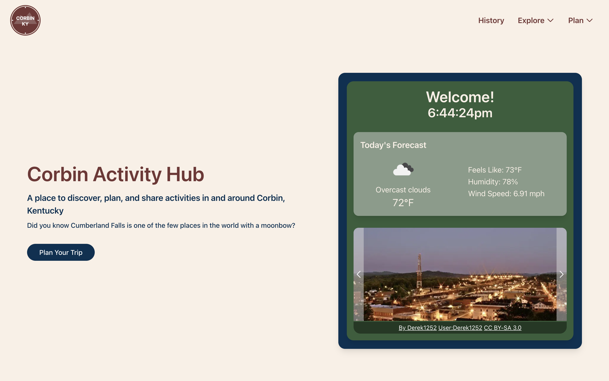

# Corbin Activity Hub  Corbin, KY

[](https://nextjs.org/)
[](https://reactjs.org/)
[](https://www.typescriptlang.org/)
[](https://tailwindcss.com/)

The Corbin Activity Hub is a web application designed to be a central resource for discovering, planning, and sharing activities in and around Corbin, Kentucky. It showcases local attractions, historical information, outdoor trails, and provides tools like a weather forecast and an interactive trip planner.

**Please Note:** This project includes a "Work in Progress" trip planning feature. Some functionalities are still under active development and refinement.

---

**Website Live Here:** [https://corbinactivityhub.com]

---

## Screenshots

*   **Homepage:** 
*   **Trails:** 
*   **Weather:** 

---

## Features

*   **Homepage:**
    *   Displays current time with a ticking clock.
    *   Fetches and shows the current weather forecast for Corbin.
    *   Features an image carousel showcasing local scenery with attributions.
    *   Provides a quick link to the trip planning section.
*   **Responsive Navigation Bar:**
    *   Logo and navigation links.
    *   Dropdown menus for "Explore" and "Plan" sections on larger screens.
    *   Collapsible mobile menu (using Headless UI) for smaller screens.
*   **History Page:**
    *   Detailed historical information about Corbin, KY.
    *   Includes an image with attribution.
*   **Trails Page:**
    *   Lists various local trails with descriptions.
    *   Interactive trail cards with hover effects to reveal more information.
    *   Responsive grid layout for trail cards.
*   **Weather Page:**
    *   Fetches and displays a 5-day weather forecast for Corbin from backend using Spring Boot and OpenWeather API.
    *   Includes loading and error states for a better user experience.
    *   Displays temperature, "feels like" temperature, humidity, wind speed, and weather icons.
*   **Trip Planner (Work in Progress):**
    *   Interactive drag-and-drop interface using `@dnd-kit/core`.
    *   Allows users to drag predefined activities (Trails, Restaurants, Shops) onto a weekly timetable.
    *   Activities can be moved within the schedule or dragged to a delete area.
    *   Dynamic highlighting of corresponding day/time slots during drag.
*   **"Taste of Corbin" Page (Under Construction):**
    *   Placeholder page for a future restaurant guide.
*   **Loading Spinner:** Custom loading spinner component for asynchronous operations.
*   **Image Optimization:** Utilizes `next/image` for optimized image loading and performance.
*   **Accessibility:**
    *   Semantic HTML and ARIA attributes are used for better accessibility (e.g., `role`, `aria-label`, `aria-hidden`).
    *   Focus management for interactive elements.

---

## Tech Stack

*   **Framework:** [Next.js](https://nextjs.org/)
*   **Language:** [TypeScript](https://www.typescriptlang.org/)
*   **UI Library:** [React](https://reactjs.org/)
*   **Styling:** [Tailwind CSS](https://tailwindcss.com/), CSS Modules
*   **UI Components:**
    *   [Headless UI](https://headlessui.com/) (for Popover, Transition components in Navbar)
    *   [Heroicons](https://heroicons.com/) (for icons)
*   **Drag & Drop:** [@dnd-kit/core](https://dndkit.com/)
*   **State Management:** React Hooks (`useState`, `useEffect`, `useCallback`, `memo`)
*   **Data Fetching:** Native `fetch` API
*   **Fonts:** `next/font` (Geist Sans, Geist Mono)

---

## ⚙Getting Started

### Prerequisites

*   Node.js (v18.x or later recommended)
*   npm, yarn, or pnpm

### Installation

1.  **Clone the repository:**
    ```bash
    git clone https://github.com/saxcrawford/corbin-activity-hub.git
    cd corbin-activity-hub
    ```

2.  **Install dependencies:**
    ```bash
    npm install
    # or
    yarn install
    # or
    pnpm install
    ```

### Running the Development Server

To start the development server:
```bash
npm run dev
# or
yarn dev
# or
pnpm dev
